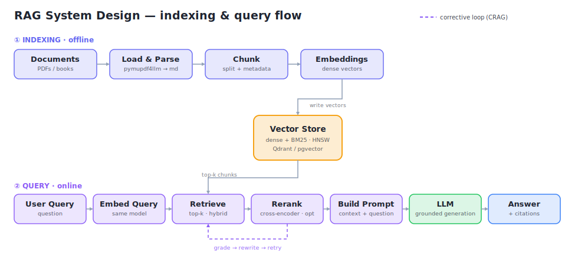

# 🏋️ RAGGym

> An open-source **gym for RAG interview prep** — train your RAG muscle by *coding* and by *chatting* with a corpus of books.

Most people "learn RAG" by reading. RAGGym makes you **practice** it. Point it at
PDFs in `data/books/` (the corpus itself is kept out of git because books are
large and often licensed), then either:

- 💬 **Chat mode** — ask questions and get cited answers from a practical RAG
  pipeline: dense vector search, optional lexical fallback, multi-query,
  reranking, and corrective self-correction.
  This is where you *see* good RAG technique in action.
- 🧠 **Practice mode** — RAGGym pulls a concept from the book, generates a coding
  exercise into your IDE, you solve it, and a reviewer agent grades your code
  against the source material.

---

## 🧭 How it works — RAG data flow

<p align="center">
  
</p>

- **① Indexing (offline):** PDFs → parse to Markdown → chunk (+metadata) → embed → write to the vector store.
- **② Query (online):** question → embed (same model) → retrieve top-k (dense + optional lexical fallback) → optional rerank → build prompt (context + question) → LLM → cited answer.
- **Corrective loop (CRAG):** grade the retrieved chunks; if weak, rewrite the query and retry.

---

## ✨ Why it's different

- **Learn by doing** — the practice loop turns passive reading into reps with real grading.
- **Practical RAG, not just a demo prompt** — dense retrieval · lexical fallback with RRF · multi-query · reranking · corrective (CRAG) self-correction, each toggleable.
- **Built for citations** — retrieved chunks keep book/page/section metadata, and the chat prompt requires inline source markers.
- **Multi-book corpus** — per-book metadata and citations from day one.
- **Zero-setup option** — runs retrieval with **FastEmbed** (local ONNX, no server, no API key).
- **Every layer swappable via `.env`** — LLM, embeddings, vector store, chunking, retrieval — no code changes.
- **Measured, not vibes** — a RAGAS evaluation harness to track quality as you tune.

---

## 🏗️ Architecture

```
src/raggym/
├── config/        typed, validated settings (pydantic-settings)
├── core/          structured logging (structlog)
├── ingestion/     PDF → per-page Markdown → heading-aware chunks → vector store
├── retrieval/     RagRetriever: dense search + lexical fallback + multi-query + rerank
├── agents/        LangGraph chat_graph: retrieve → (grade → rewrite)* → cite
├── practice/      exercise generator + pytest grader + AI reviewer
├── llm/ embeddings/ vectorstore/   provider factories (ollama/openai/anthropic · qdrant/chroma)
├── eval/          RAGAS metrics
└── apps/          Streamlit chat UI
```

---

## 🚀 Quickstart

Requires Python 3.11+.

```bash
python -m venv .venv
# Windows: .venv\Scripts\Activate.ps1   |  macOS/Linux: source .venv/bin/activate

pip install -e ".[rag,ingest,chat]"     # core + retrieval + ingestion + UI
cp .env.example .env                     # Windows: copy .env.example .env

raggym version
raggym config                            # show resolved settings
```

**Pick how you run models** (edit `.env`):

| Goal | `.env` settings |
|---|---|
| **Zero setup** (retrieval only, no LLM) | `EMBED_PROVIDER=fastembed`, `EMBED_MODEL=BAAI/bge-small-en-v1.5` |
| **Fully local** (chat + practice) | install [Ollama](https://ollama.com); `ollama pull llama3.2:3b nomic-embed-text` (defaults) |
| **Cloud** (fast demos) | `LLM_PROVIDER=openai` + `OPENAI_API_KEY=…` (or `anthropic`) |

> Embeddings/retrieval need no LLM. Chat, practice, and eval require an LLM provider (Ollama running, or an API key).

---

## 📚 Usage

```bash
# 1) Ingest your books (drop PDFs in ./data/books/)
raggym ingest                      # all books;  --limit-pages N for a quick test;  --recreate to rebuild

# 2) Chat with the corpus (Streamlit)
raggym chat

# 3) Practice by coding
raggym practice new "prompt chaining"     # writes an exercise into ./workspace/<slug>/
#   …edit workspace/<slug>/solution.py…
raggym practice grade ./workspace/<slug>  # runs tests + AI review
raggym practice list

# 4) Evaluate quality (needs the eval extra + an LLM provider)
pip install -e ".[eval]"
raggym eval
# Note: RAGAS can lag the langchain 1.x line; if import fails, pin a compatible
# langchain-community. The command reports this clearly rather than crashing.
```

---

## 🧰 Tech stack

| Layer | Default | Alternatives |
|---|---|---|
| LLM | Ollama `llama3.2:3b` | OpenAI `gpt-5.4-mini` · Anthropic `claude-sonnet-4-6` |
| Embeddings | Ollama `nomic-embed-text` | OpenAI `text-embedding-3-small` · **FastEmbed** (zero-setup) |
| Vector DB | Qdrant (local, no Docker, or remote server) | ChromaDB |
| Orchestration | LangChain LCEL + LangGraph | — |
| PDF parsing | pymupdf4llm | Docling (`parse-advanced` extra) |
| Reranking | flashrank (`rerank` extra) | — |
| UI | Streamlit | — |
| Config / Logging | pydantic-settings / structlog | — |
| Eval | RAGAS | — |

---

## 🗺️ Status

- [x] **Phase 0** — repo foundation: packaging, config, logging, CLI, tests, CI
- [x] **Phase 1** — ingestion: PDF → chunks → Qdrant/Chroma, with local corpus runs verified
- [x] **Phase 2** — retrieval engine + LangGraph chat + Streamlit chat with citations
- [x] **Phase 3** — practice mode: exercise generation + pytest grading + AI reviewer
- [x] **Phase 4** — RAGAS evaluation harness (run with a provider)
- [x] **Phase 5** — Streamlit uploads, streamed chat responses, and optional OpenAI vision captions for visual-heavy PDF pages
- [ ] Future — native sparse-vector/BM25 hybrid retrieval, API backend, auth, and richer evaluation reports

---

## 🤝 Contributing

```bash
pip install -e ".[all]"
pre-commit install
ruff check . && pytest
```

## 📄 License

[MIT](LICENSE)
